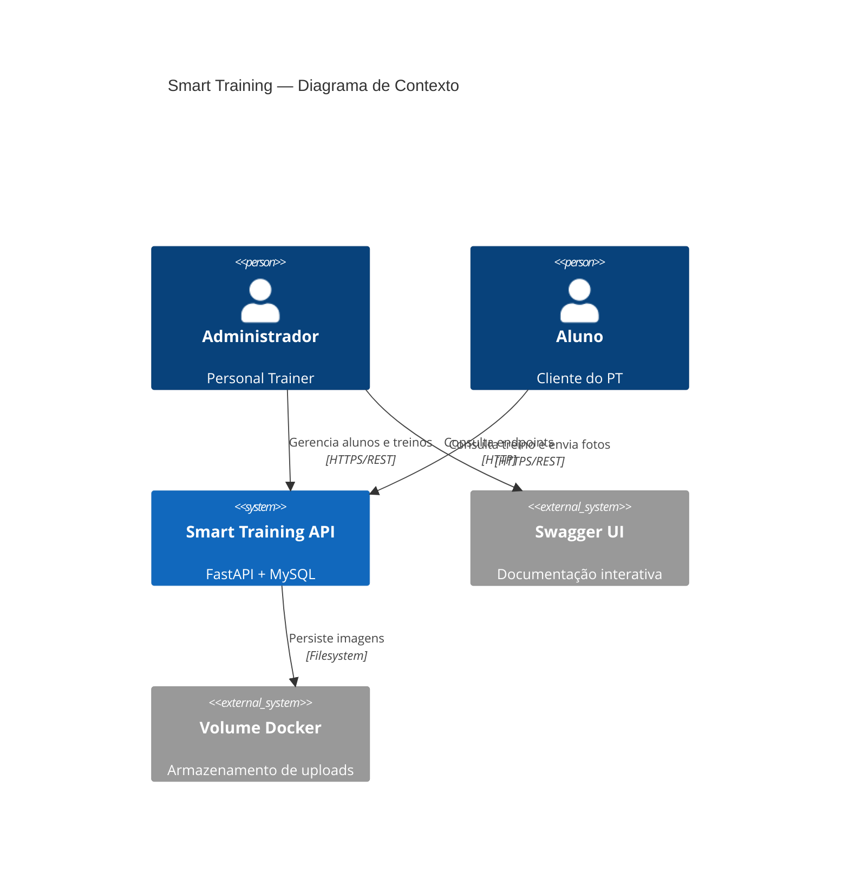
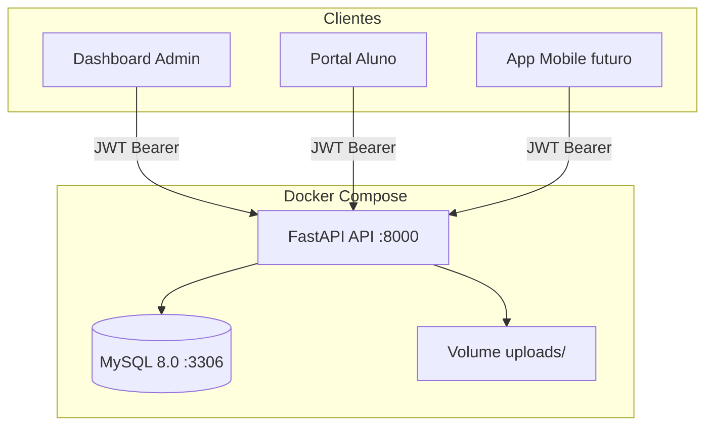

# 01 — Visão Geral

## Introdução

O **Smart Training** é uma plataforma backend (API REST) destinada a Personal Trainers que precisam gerenciar alunos, montar treinos personalizados, acompanhar frequência e evolução física. O sistema opera com dois perfis distintos — Administrador e Aluno — onde **todo o controle operacional pertence ao Administrador**.

Este documento estabelece o contexto do produto, a stack tecnológica, o escopo funcional e o glossário utilizado em toda a documentação.

## Índice

- [Missão e objetivos](#missão-e-objetivos)
- [Personas](#personas)
- [Escopo funcional](#escopo-funcional)
- [Stack tecnológica](#stack-tecnológica)
- [Diagrama de contexto](#diagrama-de-contexto)
- [Arquitetura de alto nível](#arquitetura-de-alto-nível)
- [Glossário](#glossário)
- [Documentos relacionados](#documentos-relacionados)

---

## Missão e objetivos

### Missão

Centralizar a gestão de treinos personalizados em uma API segura, permitindo que Personal Trainers administrem alunos de forma eficiente enquanto os alunos acompanham seu progresso de forma autônoma.

### Objetivos

| Objetivo | Métrica de sucesso |
|----------|-------------------|
| Gestão centralizada de alunos | CRUD completo com isolamento por admin |
| Treinos flexíveis por dia da semana | Suporte a 1–7 dias com exercícios distintos |
| Acompanhamento de frequência | Check-in diário com relatórios agregados |
| Evolução visual | Upload e consulta de fotos de progresso |
| Segurança | JWT + RBAC com isolamento de dados por tenant |

---

## Personas

### Administrador (Personal Trainer)

- **Quem é:** Profissional de educação física (CREF) que gerencia uma carteira de alunos
- **Necessidades:** Cadastrar alunos, montar treinos, definir períodos, acompanhar frequência e evolução
- **Acesso:** Total sobre alunos, treinos, exercícios, relatórios e uploads vinculados à sua conta

### Aluno

- **Quem é:** Cliente do Personal Trainer em acompanhamento
- **Necessidades:** Visualizar treino do dia/semana, registrar presença, enviar fotos de evolução
- **Acesso:** Restrito exclusivamente aos próprios dados (treino ativo, histórico, progresso)

---

## Escopo funcional

### MVP (Fase 1)

| Módulo | Admin | Aluno |
|--------|:-----:|:-----:|
| Login / Logout | ✓ | ✓ |
| CRUD de alunos | ✓ | — |
| CRUD de exercícios (catálogo) | ✓ | — |
| CRUD de treinos | ✓ | — |
| Visualizar treino | ✓ | ✓ |
| Check-in (frequência) | ✓ (consulta) | ✓ |
| Upload fotos evolução | ✓ (visualiza) | ✓ |
| Imagens ilustrativas exercícios | ✓ | ✓ (visualiza) |
| Relatórios básicos | ✓ | — |

### Fora do escopo MVP

- Cadastro público (self-register)
- Pagamentos e assinaturas
- Chat entre admin e aluno
- Notificações push
- App mobile nativo (API preparada, frontend mobile em fase posterior)

---

## Stack tecnológica

| Componente | Tecnologia | Versão mínima |
|------------|------------|---------------|
| Linguagem | Python | 3.13+ |
| Framework web | FastAPI | 0.115+ |
| Servidor ASGI (dev) | Uvicorn | 0.30+ |
| Servidor ASGI (prod) | Gunicorn + UvicornWorker | 22+ |
| ORM | SQLAlchemy | 2.0+ |
| Migrações | Alembic | 1.13+ |
| Validação | Pydantic | 2.0+ |
| Banco de dados | MySQL | 8.0+ |
| Driver MySQL | PyMySQL ou mysqlclient | — |
| Autenticação | python-jose (JWT) + passlib (bcrypt) | — |
| Upload | python-multipart | — |
| Containerização | Docker + Docker Compose | 24+ / 2.20+ |
| Testes | pytest + httpx | — |

### Dependências principais (`requirements.txt`)

```txt
fastapi>=0.115.0
uvicorn[standard]>=0.30.0
gunicorn>=22.0.0
sqlalchemy>=2.0.0
alembic>=1.13.0
pymysql>=1.1.0
cryptography>=42.0.0
pydantic>=2.0.0
pydantic-settings>=2.0.0
python-jose[cryptography]>=3.3.0
passlib[bcrypt]>=1.7.4
python-multipart>=0.0.9
pillow>=10.0.0
httpx>=0.27.0
pytest>=8.0.0
pytest-asyncio>=0.23.0
```

---

## Diagrama de contexto



---

## Arquitetura de alto nível



### Princípios arquiteturais

1. **Clean Architecture** — separação em camadas: routers → services → repositories → models
2. **Multi-tenancy por admin** — cada Personal Trainer vê apenas seus alunos e recursos
3. **API-first** — backend independente de frontend; consumível por web, mobile ou integrações
4. **Stateless** — autenticação via JWT; refresh tokens persistidos no banco para revogação
5. **UUIDs** — identificadores expostos na API são UUID v4 para evitar enumeração

---

## Glossário

| Termo | Definição |
|-------|-----------|
| **Administrador** | Usuário com role `admin`; Personal Trainer proprietário dos dados |
| **Aluno** | Usuário com role `student`; vinculado a um administrador via `admin_id` |
| **Treino (Training)** | Plano de exercícios atribuído a um aluno com período de vigência |
| **Dia de treino (Training Day)** | Configuração de exercícios para um dia específico da semana (0=seg … 6=dom) |
| **Exercício (Exercise)** | Entrada no catálogo do admin; reutilizável em múltiplos treinos |
| **Sessão** | Execução de um dia de treino em uma data específica |
| **Check-in / Frequência** | Registro de presença do aluno em uma data (`attendance_records`) |
| **Evolução** | Conjunto de fotos e métricas corporais enviadas pelo aluno ao longo do tempo |
| **Tenant** | Escopo de isolamento: todos os recursos de um admin formam um tenant lógico |
| **Treino ativo** | Treino com `status = active` e data atual entre `start_date` e `end_date` |

---

## Documentos relacionados

- [02-regras-de-negocio.md](02-regras-de-negocio.md) — Regras detalhadas e RBAC
- [03-modelagem-banco.md](03-modelagem-banco.md) — Schema do banco de dados
- [05-api-rest.md](05-api-rest.md) — Referência completa da API
- [09-estrutura-do-projeto.md](09-estrutura-do-projeto.md) — Organização do código
