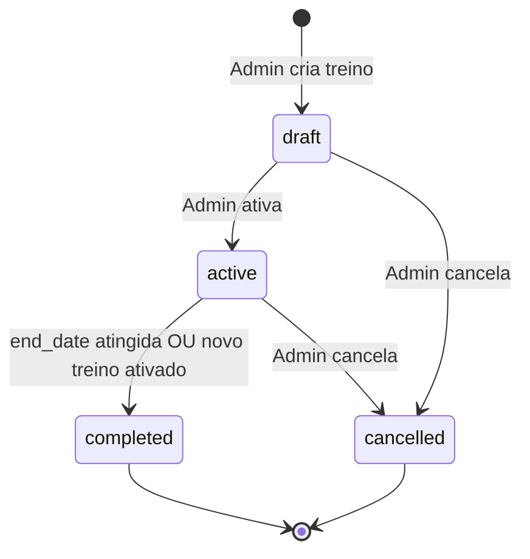

# 02 — Regras de Negócio

## Introdução

Este documento define as regras de negócio, permissões (RBAC), validações, estados e mensagens de erro padronizadas do Smart Training. Toda implementação de services e validators deve respeitar estas regras.

## Índice

- [Controle de acesso (RBAC)](#controle-de-acesso-rbac)
- [Regras de usuários](#regras-de-usuários)
- [Regras de alunos](#regras-de-alunos)
- [Regras de exercícios](#regras-de-exercícios)
- [Regras de treinos](#regras-de-treinos)
- [Regras de frequência](#regras-de-frequência)
- [Regras de evolução](#regras-de-evolução)
- [Regras de upload](#regras-de-upload)
- [Estados e transições](#estados-e-transições)
- [Mensagens de erro padronizadas](#mensagens-de-erro-padronizadas)
- [Documentos relacionados](#documentos-relacionados)

---

## Controle de acesso (RBAC)

### Roles

| Role | Valor | Descrição |
|------|-------|-----------|
| Administrador | `admin` | Personal Trainer |
| Aluno | `student` | Cliente vinculado a um admin |

### Matriz de permissões

| Recurso / Ação | Admin | Aluno |
|----------------|:-----:|:-----:|
| Login / Logout / Refresh | ✓ | ✓ |
| Ver perfil próprio (`/auth/me`) | ✓ | ✓ |
| Criar aluno | ✓ | ✗ |
| Listar/editar/excluir alunos | ✓ (próprios) | ✗ |
| CRUD exercícios (catálogo) | ✓ (próprios) | ✗ |
| CRUD treinos | ✓ (próprios alunos) | ✗ |
| Visualizar treino | ✓ (próprios alunos) | ✓ (próprio) |
| Check-in frequência | ✗ | ✓ (próprio) |
| Consultar frequência | ✓ (próprios alunos) | ✓ (próprio) |
| Enviar foto evolução | ✗ | ✓ (próprio) |
| Visualizar fotos evolução | ✓ (próprios alunos) | ✓ (próprio) |
| Relatórios | ✓ | ✗ |
| Upload imagem exercício | ✓ | ✗ |
| Visualizar imagem exercício | ✓ | ✓ (do seu treino) |

### Regra de isolamento (tenant)

> **RN-001:** Todo recurso pertence a um `admin_id`. O admin só acessa recursos onde `admin_id` corresponde ao seu `user_id`. O aluno só acessa recursos onde `student_id` corresponde ao seu perfil.

Implementação: toda query de listagem e detalhe deve filtrar por `admin_id` (admin) ou `student_id` (aluno).

---

## Regras de usuários

| ID | Regra |
|----|-------|
| RN-010 | Não existe endpoint público de registro (`POST /register`). Apenas admin cria alunos. |
| RN-011 | Email deve ser único globalmente na tabela `users`. |
| RN-012 | Senha mínima: 8 caracteres, ao menos 1 letra e 1 número. |
| RN-013 | Admin inicial é criado via seed/migration ou variável de ambiente (`ADMIN_EMAIL`, `ADMIN_PASSWORD`). |
| RN-014 | Usuário inativo (`is_active = false`) não pode autenticar. Retorna `401` com código `USER_INACTIVE`. |
| RN-015 | Aluno possui exatamente um `admin_id` imutável após criação. |

---

## Regras de alunos

| ID | Regra |
|----|-------|
| RN-020 | Apenas admin pode criar, editar e excluir alunos. |
| RN-021 | Exclusão de aluno é **soft delete** (`deleted_at` preenchido); dados históricos preservados. |
| RN-022 | Aluno soft-deleted não pode fazer login. |
| RN-023 | Admin não pode acessar alunos de outro admin. |
| RN-024 | Ao criar aluno, o sistema gera credenciais (`email` + senha temporária ou definida pelo admin). |
| RN-025 | Campos obrigatórios na criação: `email`, `password`, `full_name`. |

### Exemplo — criação de aluno

```json
{
  "email": "maria.silva@email.com",
  "password": "Senha123!",
  "full_name": "Maria Silva",
  "phone": "+5511999999999",
  "birth_date": "1990-05-15",
  "height_cm": 165,
  "weight_kg": 62.5,
  "goal": "Hipertrofia e condicionamento"
}
```

---

## Regras de exercícios

| ID | Regra |
|----|-------|
| RN-030 | Exercícios pertencem ao catálogo do admin (`admin_id`). |
| RN-031 | Um exercício pode ser reutilizado em múltiplos treinos e dias. |
| RN-032 | Exclusão de exercício do catálogo é bloqueada se estiver vinculado a treino ativo (`409 EXERCISE_IN_USE`). |
| RN-033 | Admin pode anexar até 5 imagens ilustrativas por exercício. |
| RN-034 | Nome do exercício é obrigatório e único por admin. |

---

## Regras de treinos

| ID | Regra |
|----|-------|
| RN-040 | Treino pertence a um aluno e ao admin que o criou. |
| RN-041 | `start_date` deve ser ≤ `end_date`. |
| RN-042 | Um aluno pode ter **no máximo 1 treino com status `active`** por vez. |
| RN-043 | Para ativar treino (`status → active`), deve ter ao menos 1 dia com ao menos 1 exercício. |
| RN-044 | Treino `completed` ou `cancelled` não pode ser editado (somente leitura). |
| RN-045 | Treino `draft` pode ser editado livremente. |
| RN-046 | `day_of_week` aceita valores 0–6 (0=segunda, 6=domingo). |
| RN-047 | Não pode haver dois `training_days` com o mesmo `day_of_week` no mesmo treino. |
| RN-048 | Ao ativar novo treino, treino ativo anterior do mesmo aluno é automaticamente `completed`. |

### Ciclo de vida do treino



---

## Regras de frequência

| ID | Regra |
|----|-------|
| RN-050 | Aluno registra check-in via `POST /me/attendance/check-in`. |
| RN-051 | Máximo **1 check-in por dia** por aluno (unicidade `student_id + check_in_date`). |
| RN-052 | Check-in só é permitido se aluno possui treino `active` na data. |
| RN-053 | Check-in fora do período do treino retorna `400 TRAINING_NOT_ACTIVE`. |
| RN-054 | Admin consulta frequência agregada por aluno e período. |

---

## Regras de evolução

| ID | Regra |
|----|-------|
| RN-060 | Aluno envia fotos de evolução (`progress_photos`). |
| RN-061 | Tipos de foto: `front`, `side`, `back`, `other`. |
| RN-062 | Aluno pode registrar peso opcional junto com a foto. |
| RN-063 | Admin visualiza timeline de fotos de cada aluno. |
| RN-064 | Métricas corporais (`progress_metrics`) são opcionais e independentes das fotos. |
| RN-065 | Aluno não pode excluir fotos após envio (somente admin, futuro). |

---

## Regras de upload

| ID | Regra |
|----|-------|
| RN-070 | Formatos aceitos: JPEG, PNG, WebP. |
| RN-071 | Tamanho máximo: 5 MB por arquivo. |
| RN-072 | Fotos de aluno: `uploads/students/{student_id}/{uuid}.{ext}` |
| RN-073 | Imagens de exercício: `uploads/exercises/{exercise_id}/{uuid}.{ext}` |
| RN-074 | Arquivo é validado por MIME type e magic bytes (Pillow). |
| RN-075 | Acesso a arquivos exige autenticação e permissão sobre o recurso vinculado. |

---

## Estados e transições

### Status do treino

| Status | Descrição | Editável |
|--------|-----------|:--------:|
| `draft` | Rascunho em montagem | ✓ |
| `active` | Vigente para o aluno | Parcial |
| `completed` | Período encerrado | ✗ |
| `cancelled` | Cancelado pelo admin | ✗ |

### Status do usuário

| Campo | Valores | Efeito |
|-------|---------|--------|
| `is_active` | `true` / `false` | Bloqueia login se `false` |
| `deleted_at` | `null` / datetime | Soft delete; bloqueia login |

---

## Mensagens de erro padronizadas

Toda resposta de erro segue o envelope:

```json
{
  "error": {
    "code": "TRAINING_NOT_ACTIVE",
    "message": "Não há treino ativo para a data informada.",
    "details": {}
  }
}
```

### Códigos de erro de negócio

| Código HTTP | Code | Mensagem |
|:-----------:|------|----------|
| 400 | `TRAINING_NOT_ACTIVE` | Não há treino ativo para a data informada. |
| 400 | `INVALID_DATE_RANGE` | Data inicial deve ser anterior ou igual à data final. |
| 400 | `TRAINING_EMPTY` | Treino deve ter ao menos um dia com exercícios para ser ativado. |
| 401 | `INVALID_CREDENTIALS` | Email ou senha inválidos. |
| 401 | `TOKEN_EXPIRED` | Token expirado. Utilize refresh token. |
| 401 | `USER_INACTIVE` | Usuário inativo. Contate o administrador. |
| 403 | `FORBIDDEN` | Você não tem permissão para este recurso. |
| 404 | `NOT_FOUND` | Recurso não encontrado. |
| 409 | `DUPLICATE_CHECKIN` | Check-in já registrado para esta data. |
| 409 | `ACTIVE_TRAINING_EXISTS` | Aluno já possui treino ativo. |
| 409 | `EXERCISE_IN_USE` | Exercício vinculado a treino ativo. |
| 409 | `DUPLICATE_EMAIL` | Email já cadastrado. |
| 409 | `DUPLICATE_DAY` | Dia da semana já configurado neste treino. |
| 422 | `VALIDATION_ERROR` | Erro de validação nos campos enviados. |

---

## Documentos relacionados

- [03-modelagem-banco.md](03-modelagem-banco.md) — Schema que materializa estas regras
- [04-autenticacao.md](04-autenticacao.md) — Implementação de RBAC
- [05-api-rest.md](05-api-rest.md) — Endpoints que expõem as regras
- [11-fluxos.md](11-fluxos.md) — Fluxogramas dos processos
