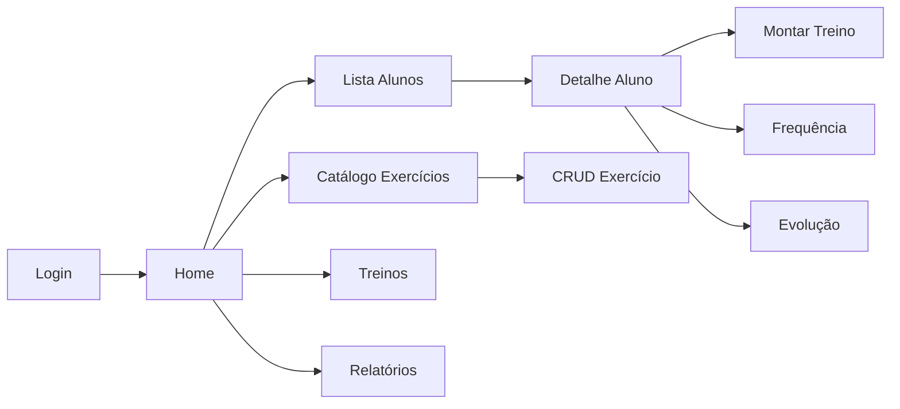

# 06 — Dashboard Admin

## Introdução

Este documento descreve as funcionalidades do painel do Personal Trainer (Administrador), mapeando telas, KPIs e integração com a API REST. Serve como guia para desenvolvimento do frontend admin e validação de requisitos.

## Índice

- [Visão geral do dashboard](#visão-geral-do-dashboard)
- [Tela: Login](#tela-login)
- [Tela: Home / Overview](#tela-home--overview)
- [Tela: Lista de alunos](#tela-lista-de-alunos)
- [Tela: Detalhe do aluno](#tela-detalhe-do-aluno)
- [Tela: Catálogo de exercícios](#tela-catálogo-de-exercícios)
- [Tela: Montagem de treino](#tela-montagem-de-treino)
- [Tela: Frequência](#tela-frequência)
- [Tela: Evolução do aluno](#tela-evolução-do-aluno)
- [Tela: Relatórios](#tela-relatórios)
- [KPIs e queries](#kpis-e-queries)
- [Documentos relacionados](#documentos-relacionados)

---

## Visão geral do dashboard



### Menu principal

| Item | Rota frontend sugerida | API principal |
|------|------------------------|---------------|
| Dashboard | `/admin` | GET /reports/overview |
| Alunos | `/admin/students` | GET /students |
| Exercícios | `/admin/exercises` | GET /exercises |
| Treinos | `/admin/trainings` | GET /trainings |
| Relatórios | `/admin/reports` | GET /reports/* |

---

## Tela: Login

### Wireframe

```
┌─────────────────────────────────────┐
│         SMART TRAINING              │
│         Área do Personal            │
│                                     │
│  Email    [________________]        │
│  Senha    [________________]        │
│                                     │
│         [ Entrar ]                  │
└─────────────────────────────────────┘
```

### Integração

- **API:** `POST /api/v1/auth/login`
- **Armazenamento:** access_token em memória; refresh_token em httpOnly cookie ou secure storage
- **Redirect:** `/admin` após sucesso
- **Erros:** exibir mensagem de `error.message` da API

---

## Tela: Home / Overview

### Wireframe

```
┌──────────────────────────────────────────────────────────┐
│ Dashboard                                    [João ▼]    │
├──────────────────────────────────────────────────────────┤
│ ┌─────────┐ ┌─────────┐ ┌─────────┐ ┌─────────┐         │
│ │   25    │ │   22    │ │   68%   │ │    3    │         │
│ │ Alunos  │ │ Ativos  │ │ Freq.   │ │ Expirando│        │
│ └─────────┘ └─────────┘ └─────────┘ └─────────┘         │
│                                                          │
│ Check-ins esta semana: 45                                │
│ Novas fotos este mês: 8                                  │
│                                                          │
│ [Ver alunos]  [Ver relatórios]                           │
└──────────────────────────────────────────────────────────┘
```

### KPIs exibidos

| KPI | Campo API | Descrição |
|-----|-----------|-----------|
| Total alunos | `total_students` | Alunos cadastrados |
| Alunos ativos | `active_students` | `is_active = true` |
| Frequência média | `avg_weekly_attendance_pct` | % check-ins vs esperado |
| Treinos expirando | `trainings_expiring_soon` | `end_date` nos próximos 14 dias |

### Integração

- **API:** `GET /api/v1/reports/overview`
- **Refresh:** ao montar componente + a cada 5 min (opcional)

---

## Tela: Lista de alunos

### Wireframe

```
┌──────────────────────────────────────────────────────────┐
│ Alunos                          [+ Novo Aluno]  [Buscar] │
├──────────────────────────────────────────────────────────┤
│ Nome           │ Email          │ Treino    │ Status     │
│ Maria Silva    │ maria@...      │ Ativo     │ ● Ativo    │
│ Pedro Costa    │ pedro@...      │ —         │ ● Ativo    │
│ Ana Souza      │ ana@...        │ Expirado  │ ○ Inativo  │
├──────────────────────────────────────────────────────────┤
│                    < 1 2 3 >                             │
└──────────────────────────────────────────────────────────┘
```

### Funcionalidades

| Ação | API |
|------|-----|
| Listar | GET /students?page=&limit=&search= |
| Criar | POST /students |
| Ver detalhe | GET /students/{id} |
| Editar | PUT /students/{id} |
| Ativar/desativar | PATCH /students/{id}/status |
| Excluir | DELETE /students/{id} |

### Formulário — Novo aluno

Campos obrigatórios: email, senha, full_name

Campos opcionais: phone, birth_date, height_cm, weight_kg, goal, notes

Validação client-side alinhada a RN-012 (senha 8+ chars, letra + número).

---

## Tela: Detalhe do aluno

### Wireframe

```
┌──────────────────────────────────────────────────────────┐
│ ← Alunos    Maria Silva                    [Editar] [···]│
├──────────────────────────────────────────────────────────┤
│ Dados        │ Treino Ativo    │ Frequência │ Evolução   │
├──────────────┴─────────────────┴────────────┴────────────┤
│ Email: maria@email.com                                   │
│ Telefone: +5511999999999                                 │
│ Objetivo: Hipertrofia                                    │
│ Peso: 62.5 kg │ Altura: 165 cm                           │
│                                                          │
│ Treino: Hipertrofia Q1 (01/01 – 31/03) [Ver treino]      │
│ Último check-in: 15/07/2026                              │
└──────────────────────────────────────────────────────────┘
```

### Abas

| Aba | Conteúdo | APIs |
|-----|----------|------|
| Dados | Perfil completo | GET /students/{id} |
| Treino | Treino ativo + histórico | GET /trainings?student_id=, GET /reports/students/{id} |
| Frequência | Calendário/lista check-ins | GET /students/{id}/attendance |
| Evolução | Galeria de fotos + gráfico peso | GET /students/{id}/progress/photos, /progress/metrics |

---

## Tela: Catálogo de exercícios

### Wireframe

```
┌──────────────────────────────────────────────────────────┐
│ Exercícios                    [+ Novo]  [Filtrar grupo ▼]│
├──────────────────────────────────────────────────────────┤
│ ┌────────┐  Supino Reto        │ Peito  │ 4x10 │ [✎][🗑]│
│ │ [img]  │  Agachamento Livre  │ Pernas │ 4x12 │ [✎][🗑]│
│ └────────┘  Remada Curvada      │ Costas │ 3x12 │ [✎][🗑]│
└──────────────────────────────────────────────────────────┘
```

### Funcionalidades

| Ação | API |
|------|-----|
| Listar | GET /exercises?muscle_group= |
| Criar/editar | POST/PUT /exercises |
| Upload imagem | POST /exercises/{id}/images |
| Remover imagem | DELETE /exercises/{id}/images/{image_id} |
| Excluir | DELETE /exercises/{id} |

### Grupos musculares sugeridos

`peito`, `costas`, `pernas`, `ombros`, `biceps`, `triceps`, `abdomen`, `gluteos`, `cardio`, `full_body`

---

## Tela: Montagem de treino

### Wireframe

```
┌──────────────────────────────────────────────────────────┐
│ Treino: Hipertrofia Q1          Status: [draft ▼] [Salvar]│
├──────────────────────────────────────────────────────────┤
│ Aluno: Maria Silva    Início: [01/01/26]  Fim: [31/03/26]│
├──────────────────────────────────────────────────────────┤
│ [Seg] [Ter] [Qua] [Qui] [Sex] [Sáb] [Dom]                │
├──────────────────────────────────────────────────────────┤
│ Segunda — Peito e Tríceps              [+ Exercício]     │
│ 1. Supino Reto      4x10  40kg  90s rest    [✎][🗑]      │
│ 2. Crucifixo        3x12  12kg  60s rest    [✎][🗑]      │
└──────────────────────────────────────────────────────────┘
```

### Fluxo de montagem

1. Criar treino (`POST /trainings`) — status `draft`
2. Adicionar dias (`POST /trainings/{id}/days`)
3. Para cada dia, adicionar exercícios do catálogo (`POST .../exercises`)
4. Ativar treino (`PUT /trainings/{id}` com `status: active`)

### Validações UI

- Bloquear ativação se nenhum dia tem exercícios
- Confirmar ao ativar se já existe treino ativo (API retorna 409)
- Desabilitar edição se status `completed` ou `cancelled`

---

## Tela: Frequência

### Wireframe

```
┌──────────────────────────────────────────────────────────┐
│ Frequência — Maria Silva     Período: [01/07] – [31/07]  │
├──────────────────────────────────────────────────────────┤
│ Taxa: 75% (12/16 sessões)                                │
│                                                          │
│  Jul 2026                                                │
│  Dom Seg Ter Qua Qui Sex Sáb                             │
│        1   2   3   4   5                                 │
│        ✓   ✓       ✓   ✓                                 │
│   6   7   8   9  10  11  12                              │
│   ✓       ✓   ✓       ✓                                  │
└──────────────────────────────────────────────────────────┘
```

### Integração

- **API:** GET /students/{id}/attendance?start_date=&end_date=
- **Summary:** usar campo `summary.attendance_rate_pct`
- **Calendário:** marcar dias com check-in a partir de `items[].check_in_date`

---

## Tela: Evolução do aluno

### Wireframe

```
┌──────────────────────────────────────────────────────────┐
│ Evolução — Maria Silva                                   │
├──────────────────────────────────────────────────────────┤
│ Peso: 62.5 → 61.0 kg (-1.5 kg)                           │
│ [Gráfico linha: peso ao longo do tempo]                  │
├──────────────────────────────────────────────────────────┤
│ ┌─────┐ ┌─────┐ ┌─────┐ ┌─────┐                         │
│ │front│ │side │ │back │ │front│  Timeline fotos         │
│ │07/01│ │07/01│ │07/01│ │01/07│                         │
│ └─────┘ └─────┘ └─────┘ └─────┘                         │
└──────────────────────────────────────────────────────────┘
```

### Integração

- Fotos: GET /students/{id}/progress/photos
- Métricas: GET /students/{id}/progress/metrics
- Relatório: GET /reports/students/{id} (delta peso)

---

## Tela: Relatórios

### Wireframe

```
┌──────────────────────────────────────────────────────────┐
│ Relatórios              Período: [01/07/26] – [31/07/26] │
├──────────────────────────────────────────────────────────┤
│ Frequência por aluno                                     │
│ Nome           │ Check-ins │ Esperado │ Taxa            │
│ Maria Silva    │     8     │    12    │ 66.7%           │
│ Pedro Costa    │    10     │    12    │ 83.3%           │
└──────────────────────────────────────────────────────────┘
```

### Integração

- GET /reports/attendance?start_date=&end_date=
- Export CSV (funcionalidade frontend, dados da API)

---

## KPIs e queries

### Query — alunos ativos

```sql
SELECT COUNT(*) FROM student_profiles sp
JOIN users u ON u.id = sp.user_id
WHERE sp.admin_id = :admin_id
  AND u.is_active = 1
  AND sp.deleted_at IS NULL;
```

### Query — frequência semanal

```sql
SELECT
  COUNT(DISTINCT ar.student_id) AS students_with_checkin,
  COUNT(ar.id) AS total_checkins
FROM attendance_records ar
JOIN student_profiles sp ON sp.user_id = ar.student_id
WHERE sp.admin_id = :admin_id
  AND ar.check_in_date >= DATE_SUB(CURDATE(), INTERVAL 7 DAY);
```

### Query — treinos expirando

```sql
SELECT COUNT(*) FROM trainings
WHERE admin_id = :admin_id
  AND status = 'active'
  AND end_date BETWEEN CURDATE() AND DATE_ADD(CURDATE(), INTERVAL 14 DAY);
```

---

## Documentos relacionados

- [05-api-rest.md](05-api-rest.md) — Endpoints utilizados
- [02-regras-de-negocio.md](02-regras-de-negocio.md) — Regras de permissão
- [07-area-aluno.md](07-area-aluno.md) — Perspectiva do aluno
- [11-fluxos.md](11-fluxos.md) — Fluxogramas de processos
