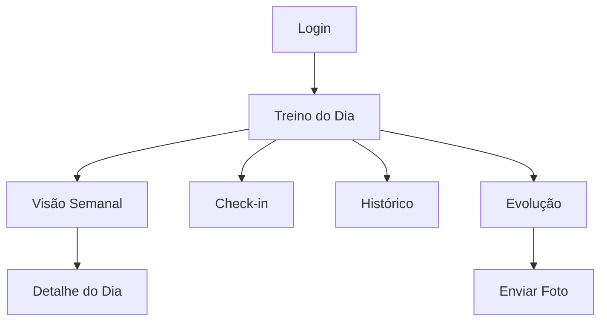

# 07 — Área do Aluno

## Introdução

Este documento descreve a experiência do aluno no Smart Training: telas, regras de visualização, integração com a API e limites operacionais. O aluno possui acesso restrito exclusivamente aos próprios dados.

## Índice

- [Visão geral](#visão-geral)
- [Tela: Login](#tela-login)
- [Tela: Home / Treino do dia](#tela-home--treino-do-dia)
- [Tela: Visão semanal](#tela-visão-semanal)
- [Tela: Detalhe do dia](#tela-detalhe-do-dia)
- [Tela: Check-in](#tela-check-in)
- [Tela: Histórico](#tela-histórico)
- [Tela: Evolução / Fotos](#tela-evolução--fotos)
- [Tela: Progresso](#tela-progresso)
- [Regras de visualização](#regras-de-visualização)
- [Limites de upload](#limites-de-upload)
- [Documentos relacionados](#documentos-relacionados)

---

## Visão geral



### Menu principal (mobile-first sugerido)

| Item | Ícone | Rota | API |
|------|-------|------|-----|
| Hoje | 🏋️ | `/student` | GET /me/training/days/{dow} |
| Semana | 📅 | `/student/week` | GET /me/training |
| Evolução | 📸 | `/student/progress` | GET /me/progress |
| Histórico | 📋 | `/student/history` | GET /me/history |
| Perfil | 👤 | `/student/profile` | GET /auth/me |

---

## Tela: Login

### Wireframe

```
┌─────────────────────────────────────┐
│         SMART TRAINING              │
│         Área do Aluno               │
│                                     │
│  Email    [________________]        │
│  Senha    [________________]        │
│                                     │
│         [ Entrar ]                  │
│                                     │
│  Dúvidas? Fale com seu personal.    │
└─────────────────────────────────────┘
```

### Integração

- **API:** `POST /api/v1/auth/login`
- **Nota:** Não há link de cadastro — credenciais fornecidas pelo Personal Trainer
- **Redirect:** `/student` após sucesso

---

## Tela: Home / Treino do dia

### Wireframe

```
┌─────────────────────────────────────┐
│ Olá, Maria!           Qua, 16 Jul   │
├─────────────────────────────────────┤
│ Hipertrofia Q1                      │
│ 01/01/2026 – 31/03/2026  (55% done) │
├─────────────────────────────────────┤
│ HOJE — Quarta-feira                 │
│ Costas e Bíceps                     │
│                                     │
│ 1. Remada Curvada    4x10  30kg     │
│ 2. Puxada Frontal    3x12  45kg     │
│ 3. Rosca Direta      3x12  12kg     │
│                                     │
│ [Ver imagens]  [Check-in ✓]         │
├─────────────────────────────────────┤
│ [Hoje] [Semana] [Evolução] [Hist.]  │
└─────────────────────────────────────┘
```

### Lógica

1. Obter `day_of_week` atual (0=seg … 6=dom)
2. Chamar `GET /me/training/days/{day_of_week}`
3. Se 404: exibir "Dia de descanso" ou "Treino não configurado para hoje"
4. Exibir barra de progresso: dias entre start_date e end_date

### Integração

- **API principal:** GET /me/training/days/{day_of_week}
- **Fallback:** GET /me/training (treino completo)
- **Check-in status:** campo `checked_in_today` da resposta

---

## Tela: Visão semanal

### Wireframe

```
┌─────────────────────────────────────┐
│ Minha Semana                        │
├─────────────────────────────────────┤
│ Seg  Ter  Qua  Qui  Sex  Sáb  Dom   │
│ [●]  [○]  [●]  [○]  [●]  [○]  [○]   │
│ Peito     Costas    Pernas           │
├─────────────────────────────────────┤
│ ● = dia com treino                  │
│ ○ = descanso                        │
│ ✓ = check-in feito (overlay)        │
└─────────────────────────────────────┘
```

### Formato de exibição

Para cada dia com treino (`days[]` de GET /me/training):

| Campo | Exibição |
|-------|----------|
| `day_of_week` | Nome abreviado (Seg, Ter…) |
| `label` | Subtítulo (ex: "Peito e Tríceps") |
| `exercises.length` | Badge "N exercícios" |
| Check-in | Indicador visual se data passada teve check-in |

### Integração

- **API:** GET /me/training
- **Interação:** toque no dia → navega para Detalhe do Dia

---

## Tela: Detalhe do dia

### Wireframe

```
┌─────────────────────────────────────┐
│ ← Semana   Segunda-feira            │
│ Peito e Tríceps                     │
├─────────────────────────────────────┤
│ ┌─────────────────────────────────┐ │
│ │ 1. Supino Reto                  │ │
│ │    4 séries × 10 reps           │ │
│ │    Carga: 40 kg │ Descanso: 90s │ │
│ │    [🖼 Ver execução]            │ │
│ └─────────────────────────────────┘ │
│ ┌─────────────────────────────────┐ │
│ │ 2. Crucifixo                    │ │
│ │    3 séries × 12 reps           │ │
│ │    Carga: 12 kg │ Descanso: 60s │ │
│ └─────────────────────────────────┘ │
└─────────────────────────────────────┘
```

### Card de exercício

Cada exercício exibe:

```json
{
  "exercise_name": "Supino Reto",
  "sets": 4,
  "reps": 10,
  "load_kg": 40.0,
  "rest_seconds": 90,
  "notes": "Cadência 3-1-2",
  "images": [{ "url": "/api/v1/uploads/exercises/..." }]
}
```

### Imagens dos exercícios

- Galeria modal ao tocar "Ver execução"
- Imagens servidas via GET /uploads/exercises/{filename} com Bearer token
- Somente imagens dos exercícios presentes no treino do aluno

---

## Tela: Check-in

### Wireframe

```
┌─────────────────────────────────────┐
│ Registrar Presença                  │
├─────────────────────────────────────┤
│ Data: 16/07/2026                    │
│ Treino: Hipertrofia Q1              │
│                                     │
│ Observação (opcional):              │
│ [________________________]          │
│                                     │
│         [Confirmar Check-in]        │
└─────────────────────────────────────┘
```

### Integração

- **API:** POST /me/attendance/check-in
- **Sucesso:** toast "Presença registrada!" + atualizar `checked_in_today`
- **Erros:**
  - 409 `DUPLICATE_CHECKIN` → "Você já registrou presença hoje"
  - 400 `TRAINING_NOT_ACTIVE` → "Nenhum treino ativo no momento"

### Regras UI

- Botão check-in visível apenas se treino ativo
- Desabilitar após check-in do dia
- Permitir apenas 1 check-in por dia (RN-051)

---

## Tela: Histórico

### Wireframe

```
┌─────────────────────────────────────┐
│ Histórico                           │
├─────────────────────────────────────┤
│ Treinos Anteriores                  │
│ ┌─────────────────────────────────┐ │
│ │ Adaptação Inicial               │ │
│ │ Out–Dez 2025 │ Concluído         │ │
│ └─────────────────────────────────┘ │
│                                     │
│ Check-ins Recentes                  │
│ • 16/07 — Hipertrofia Q1            │
│ • 15/07 — Hipertrofia Q1            │
│ • 14/07 — Hipertrofia Q1            │
└─────────────────────────────────────┘
```

### Integração

- **API:** GET /me/history
- Exibe `trainings[]` (status completed/cancelled) e `recent_check_ins[]`

---

## Tela: Evolução / Fotos

### Wireframe

```
┌─────────────────────────────────────┐
│ Minha Evolução          [+ Enviar]  │
├─────────────────────────────────────┤
│ Peso atual: 61.0 kg (-1.5 kg)       │
├─────────────────────────────────────┤
│ ┌─────┐  01/07/2026                 │
│ │front│  61.5 kg — 4 semanas        │
│ └─────┘                             │
│ ┌─────┐  01/06/2026                 │
│ │side │  62.0 kg — Início          │
│ └─────┘                             │
└─────────────────────────────────────┘
```

### Formulário — Enviar foto

| Campo | Tipo | Obrigatório |
|-------|------|:-----------:|
| Foto | file (camera/galeria) | Sim |
| Tipo | select: front, side, back, other | Não |
| Peso (kg) | number | Não |
| Data | date | Não |
| Observação | text | Não |

### Integração

- Listar: GET /me/progress/photos
- Enviar: POST /me/progress/photos (multipart/form-data)
- Resumo: GET /me/progress

---

## Tela: Progresso

### Wireframe

```
┌─────────────────────────────────────┐
│ Meu Progresso                       │
├─────────────────────────────────────┤
│ Treino: Hipertrofia Q1              │
│ Período: 01/01 – 31/03/2026         │
│ Restam: 45 dias                     │
├─────────────────────────────────────┤
│ Check-ins: 12                       │
│ Frequência: 75%                     │
├─────────────────────────────────────┤
│ Peso inicial: 62.5 kg               │
│ Peso atual: 61.0 kg                 │
│ Variação: -1.5 kg                   │
└─────────────────────────────────────┘
```

### Integração

- **API:** GET /me/progress
- Campos: `latest_weight_kg`, `initial_weight_kg`, `weight_delta_kg`, `photos_count`, `check_ins_total`

---

## Regras de visualização

| Regra | Descrição |
|-------|-----------|
| RV-001 | Aluno vê apenas treino com `status = active` |
| RV-002 | Se não há treino ativo, exibir tela "Aguardando treino do seu personal" |
| RV-003 | Treinos `draft` nunca são visíveis ao aluno |
| RV-004 | Histórico inclui treinos `completed` e `cancelled` |
| RV-005 | Imagens de exercícios: somente as vinculadas ao treino ativo |
| RV-006 | Fotos de evolução: somente as do próprio aluno |
| RV-007 | Datas do treino sempre visíveis (start_date, end_date) |
| RV-008 | Progresso (%): `(hoje - start_date) / (end_date - start_date) * 100` |

### Mapeamento day_of_week

| Valor | Dia |
|:-----:|-----|
| 0 | Segunda-feira |
| 1 | Terça-feira |
| 2 | Quarta-feira |
| 3 | Quinta-feira |
| 4 | Sexta-feira |
| 5 | Sábado |
| 6 | Domingo |

---

## Limites de upload

| Limite | Valor |
|--------|-------|
| Tamanho máximo | 5 MB |
| Formatos | JPEG, PNG, WebP |
| Tipos MIME | `image/jpeg`, `image/png`, `image/webp` |
| Validação | Magic bytes via Pillow no backend |
| Compressão client | Recomendado max 1920px largura antes do envio |

### Exemplo — upload com curl

```bash
curl -X POST http://localhost:8000/api/v1/me/progress/photos \
  -H "Authorization: Bearer $TOKEN" \
  -F "file=@/path/to/photo.jpg" \
  -F "photo_type=front" \
  -F "weight_kg=61.0" \
  -F "taken_at=2026-07-16"
```

### Resposta de erro — arquivo inválido

```json
{
  "error": {
    "code": "VALIDATION_ERROR",
    "message": "Arquivo inválido.",
    "details": {
      "file": ["Formato não suportado. Use JPEG, PNG ou WebP."]
    }
  }
}
```

---

## Documentos relacionados

- [05-api-rest.md](05-api-rest.md) — Endpoints `/me/*`
- [02-regras-de-negocio.md](02-regras-de-negocio.md) — Regras RN-050 a RN-075
- [06-dashboard-admin.md](06-dashboard-admin.md) — Perspectiva do admin
- [11-fluxos.md](11-fluxos.md) — Fluxos do aluno
