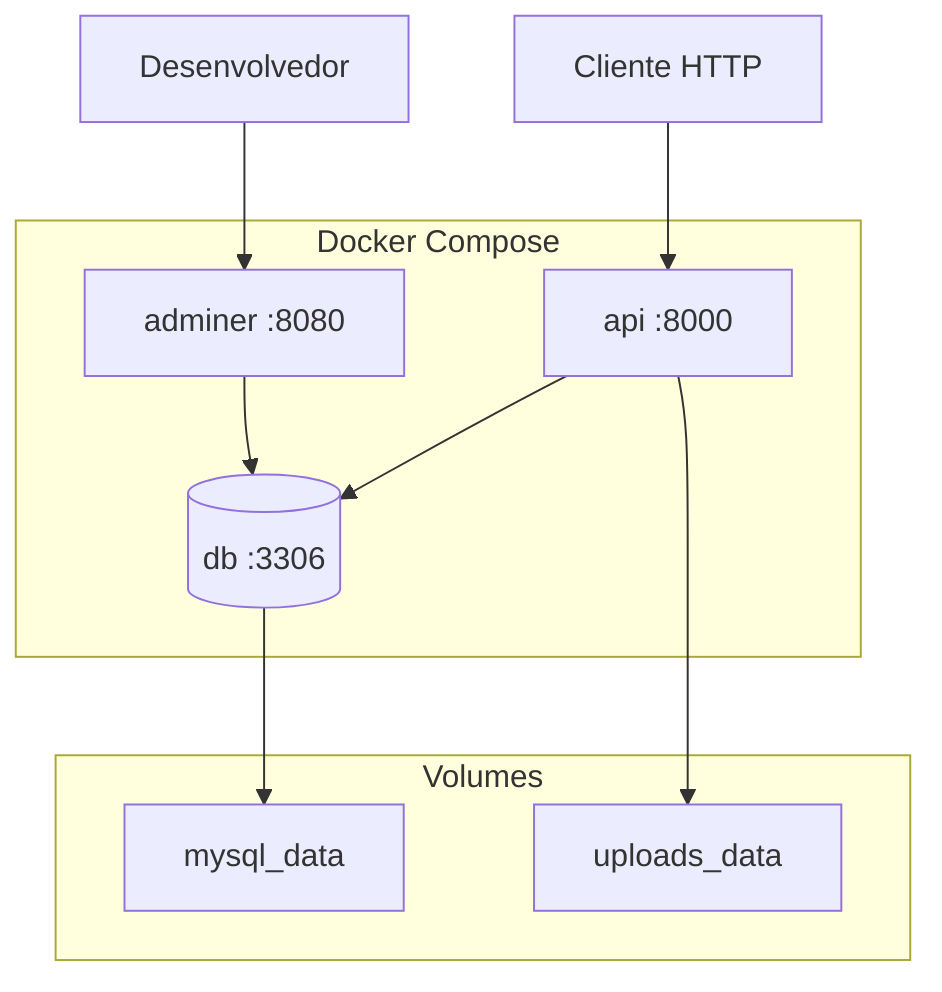

# 08 — Docker

## Introdução

Este documento descreve a containerização do Smart Training com Docker e Docker Compose: Dockerfile multi-stage, compose para desenvolvimento e produção, variáveis de ambiente, volumes, rede e comandos operacionais.

## Índice

- [Visão geral](#visão-geral)
- [Estrutura de arquivos Docker](#estrutura-de-arquivos-docker)
- [Dockerfile](#dockerfile)
- [docker-compose.yml](#docker-composeyml)
- [Variáveis de ambiente](#variáveis-de-ambiente)
- [Volumes](#volumes)
- [Rede](#rede)
- [Desenvolvimento local](#desenvolvimento-local)
- [Produção](#produção)
- [Troubleshooting](#troubleshooting)
- [Documentos relacionados](#documentos-relacionados)

---

## Visão geral



| Serviço | Imagem/Build | Porta host | Descrição |
|---------|--------------|:----------:|-----------|
| `api` | Build local (Dockerfile) | 8000 | FastAPI application |
| `db` | mysql:8.0 | 3306 | Banco de dados |
| `adminer` | adminer:latest | 8080 | GUI MySQL (dev only) |

---

## Estrutura de arquivos Docker

```
smart_training/
├── Dockerfile
├── docker-compose.yml
├── docker-compose.prod.yml
├── .env.example
├── .dockerignore
└── app/
    └── ...
```

---

## Dockerfile

Multi-stage build para imagem otimizada de produção.

```dockerfile
# ── Stage 1: Builder ──
FROM python:3.13-slim AS builder

WORKDIR /build

RUN apt-get update && apt-get install -y --no-install-recommends \
    gcc \
    default-libmysqlclient-dev \
    pkg-config \
    && rm -rf /var/lib/apt/lists/*

COPY requirements.txt .
RUN pip install --no-cache-dir --prefix=/install -r requirements.txt

# ── Stage 2: Runtime ──
FROM python:3.13-slim AS runtime

WORKDIR /app

RUN apt-get update && apt-get install -y --no-install-recommends \
    default-libmysqlclient-dev \
    && rm -rf /var/lib/apt/lists/* \
    && addgroup --system appgroup \
    && adduser --system --ingroup appgroup appuser

COPY --from=builder /install /usr/local
COPY app/ ./app/
COPY alembic/ ./alembic/
COPY alembic.ini .

RUN mkdir -p /app/uploads/students /app/uploads/exercises \
    && chown -R appuser:appgroup /app

USER appuser

EXPOSE 8000

HEALTHCHECK --interval=30s --timeout=5s --start-period=10s --retries=3 \
    CMD python -c "import urllib.request; urllib.request.urlopen('http://localhost:8000/health')" || exit 1

CMD ["gunicorn", "app.main:app", \
     "--worker-class", "uvicorn.workers.UvicornWorker", \
     "--bind", "0.0.0.0:8000", \
     "--workers", "4", \
     "--timeout", "120", \
     "--access-logfile", "-"]
```

### Dockerfile para desenvolvimento

Alternativa com hot-reload (usado via override ou comando no compose):

```dockerfile
# Dockerfile.dev
FROM python:3.13-slim

WORKDIR /app

RUN apt-get update && apt-get install -y --no-install-recommends \
    gcc default-libmysqlclient-dev pkg-config \
    && rm -rf /var/lib/apt/lists/*

COPY requirements.txt .
RUN pip install --no-cache-dir -r requirements.txt

COPY . .

CMD ["uvicorn", "app.main:app", "--host", "0.0.0.0", "--port", "8000", "--reload"]
```

---

## docker-compose.yml

### Desenvolvimento

```yaml
services:
  api:
    build:
      context: .
      dockerfile: Dockerfile.dev
    container_name: smart_training_api
    ports:
      - "8000:8000"
    env_file:
      - .env
    volumes:
      - ./app:/app/app
      - ./alembic:/app/alembic
      - uploads_data:/app/uploads
    depends_on:
      db:
        condition: service_healthy
    networks:
      - smart_training_net
    restart: unless-stopped

  db:
    image: mysql:8.0
    container_name: smart_training_db
    ports:
      - "3306:3306"
    environment:
      MYSQL_ROOT_PASSWORD: ${MYSQL_ROOT_PASSWORD}
      MYSQL_DATABASE: ${MYSQL_DATABASE}
      MYSQL_USER: ${MYSQL_USER}
      MYSQL_PASSWORD: ${MYSQL_PASSWORD}
    volumes:
      - mysql_data:/var/lib/mysql
    healthcheck:
      test: ["CMD", "mysqladmin", "ping", "-h", "localhost", "-u", "root", "-p${MYSQL_ROOT_PASSWORD}"]
      interval: 10s
      timeout: 5s
      retries: 5
      start_period: 30s
    networks:
      - smart_training_net
    restart: unless-stopped

  adminer:
    image: adminer:latest
    container_name: smart_training_adminer
    ports:
      - "8080:8080"
    depends_on:
      - db
    networks:
      - smart_training_net
    profiles:
      - dev

volumes:
  mysql_data:
    driver: local
  uploads_data:
    driver: local

networks:
  smart_training_net:
    driver: bridge
```

### Produção (`docker-compose.prod.yml`)

```yaml
services:
  api:
    build:
      context: .
      dockerfile: Dockerfile
      target: runtime
    container_name: smart_training_api
    ports:
      - "8000:8000"
    env_file:
      - .env.production
    volumes:
      - uploads_data:/app/uploads
    depends_on:
      db:
        condition: service_healthy
    networks:
      - smart_training_net
    restart: always
    deploy:
      resources:
        limits:
          cpus: "2"
          memory: 1G

  db:
    image: mysql:8.0
    container_name: smart_training_db
    environment:
      MYSQL_ROOT_PASSWORD: ${MYSQL_ROOT_PASSWORD}
      MYSQL_DATABASE: ${MYSQL_DATABASE}
      MYSQL_USER: ${MYSQL_USER}
      MYSQL_PASSWORD: ${MYSQL_PASSWORD}
    volumes:
      - mysql_data:/var/lib/mysql
    healthcheck:
      test: ["CMD", "mysqladmin", "ping", "-h", "localhost"]
      interval: 10s
      timeout: 5s
      retries: 5
    networks:
      - smart_training_net
    restart: always
    # Não expor porta 3306 em produção

volumes:
  mysql_data:
  uploads_data:

networks:
  smart_training_net:
    driver: bridge
```

---

## Variáveis de ambiente

### `.env.example`

```env
# ── Application ──
APP_NAME=Smart Training
APP_ENV=development
APP_DEBUG=true
APP_VERSION=1.0.0

# ── Database ──
DATABASE_URL=mysql+pymysql://smart_user:smart_pass@db:3306/smart_training
MYSQL_ROOT_PASSWORD=root_secret_change_me
MYSQL_DATABASE=smart_training
MYSQL_USER=smart_user
MYSQL_PASSWORD=smart_pass

# ── JWT ──
JWT_SECRET_KEY=change-me-to-a-256-bit-random-string-in-production
JWT_ALGORITHM=HS256
ACCESS_TOKEN_EXPIRE_MINUTES=15
REFRESH_TOKEN_EXPIRE_DAYS=7

# ── Admin Seed ──
ADMIN_EMAIL=admin@smarttraining.local
ADMIN_PASSWORD=Admin123!

# ── Upload ──
UPLOAD_MAX_SIZE_MB=5
UPLOAD_ALLOWED_EXTENSIONS=jpg,jpeg,png,webp
UPLOAD_DIR=/app/uploads

# ── CORS ──
CORS_ORIGINS=http://localhost:3000,http://localhost:5173
```

### Referência completa

| Variável | Obrigatória | Default | Descrição |
|----------|:-----------:|---------|-----------|
| `APP_NAME` | Não | Smart Training | Nome da aplicação |
| `APP_ENV` | Não | development | `development` \| `production` |
| `APP_DEBUG` | Não | false | Debug mode |
| `DATABASE_URL` | Sim | — | SQLAlchemy connection string |
| `MYSQL_ROOT_PASSWORD` | Sim | — | Senha root MySQL |
| `MYSQL_DATABASE` | Sim | smart_training | Nome do database |
| `MYSQL_USER` | Sim | — | Usuário da aplicação |
| `MYSQL_PASSWORD` | Sim | — | Senha do usuário |
| `JWT_SECRET_KEY` | Sim | — | Chave secreta JWT (min 32 chars) |
| `JWT_ALGORITHM` | Não | HS256 | Algoritmo JWT |
| `ACCESS_TOKEN_EXPIRE_MINUTES` | Não | 15 | TTL access token |
| `REFRESH_TOKEN_EXPIRE_DAYS` | Não | 7 | TTL refresh token |
| `ADMIN_EMAIL` | Sim* | — | Email admin seed (* primeira execução) |
| `ADMIN_PASSWORD` | Sim* | — | Senha admin seed |
| `UPLOAD_MAX_SIZE_MB` | Não | 5 | Tamanho máximo upload |
| `UPLOAD_DIR` | Não | /app/uploads | Diretório de uploads |
| `CORS_ORIGINS` | Não | * | Origens CORS separadas por vírgula |

---

## Volumes

| Volume | Mount point | Propósito | Backup |
|--------|-------------|-----------|:------:|
| `mysql_data` | `/var/lib/mysql` | Dados persistentes MySQL | Sim |
| `uploads_data` | `/app/uploads` | Fotos alunos + imagens exercícios | Sim |

### Backup manual

```bash
# Backup MySQL
docker compose exec db mysqldump -u root -p${MYSQL_ROOT_PASSWORD} smart_training > backup.sql

# Backup uploads
docker run --rm -v smart_training_uploads_data:/data -v $(pwd):/backup alpine \
  tar czf /backup/uploads_backup.tar.gz -C /data .
```

### Restore

```bash
docker compose exec -T db mysql -u root -p${MYSQL_ROOT_PASSWORD} smart_training < backup.sql
```

---

## Rede

| Item | Valor |
|------|-------|
| Nome | `smart_training_net` |
| Driver | bridge |
| Comunicação interna | `api` → `db:3306` |
| Exposição externa (dev) | API `:8000`, DB `:3306`, Adminer `:8080` |
| Exposição externa (prod) | Apenas API `:8000` (via reverse proxy recomendado) |

---

## Desenvolvimento local

### Primeira execução

```bash
# 1. Clone e entre no diretório
cd smart_training

# 2. Configure variáveis
cp .env.example .env

# 3. Suba os serviços
docker compose up -d

# 4. Aguarde healthcheck do MySQL
docker compose ps

# 5. Execute migrações
docker compose exec api alembic upgrade head

# 6. Verifique
curl http://localhost:8000/health
open http://localhost:8000/docs
```

### Comandos úteis

```bash
# Logs
docker compose logs -f api

# Shell no container
docker compose exec api bash

# Criar migration
docker compose exec api alembic revision --autogenerate -m "add_table_x"

# Rodar testes
docker compose exec api pytest -v

# Parar
docker compose down

# Parar e remover volumes (CUIDADO: apaga dados)
docker compose down -v

# Adminer (dev)
docker compose --profile dev up -d adminer
# Acesse http://localhost:8080
# Server: db | User: smart_user | Password: smart_pass | Database: smart_training
```

---

## Produção

### Checklist de deploy

- [ ] Gerar `JWT_SECRET_KEY` seguro (256 bits): `openssl rand -hex 32`
- [ ] Criar `.env.production` com senhas fortes
- [ ] Remover exposição da porta 3306
- [ ] Configurar reverse proxy (Nginx/Traefik) com HTTPS
- [ ] Configurar backup automático de `mysql_data` e `uploads_data`
- [ ] Definir `APP_DEBUG=false` e `APP_ENV=production`
- [ ] Configurar CORS com domínios reais
- [ ] Configurar log aggregation (JSON structured logs)

### Deploy

```bash
# Build e start
docker compose -f docker-compose.prod.yml up -d --build

# Migrations
docker compose -f docker-compose.prod.yml exec api alembic upgrade head

# Verificar health
curl https://api.smarttraining.com/health
```

### Nginx reverse proxy (exemplo)

```nginx
server {
    listen 443 ssl http2;
    server_name api.smarttraining.com;

    ssl_certificate     /etc/letsencrypt/live/api.smarttraining.com/fullchain.pem;
    ssl_certificate_key /etc/letsencrypt/live/api.smarttraining.com/privkey.pem;

    client_max_body_size 6M;

    location / {
        proxy_pass http://127.0.0.1:8000;
        proxy_set_header Host $host;
        proxy_set_header X-Real-IP $remote_addr;
        proxy_set_header X-Forwarded-For $proxy_add_x_forwarded_for;
        proxy_set_header X-Forwarded-Proto $scheme;
    }
}
```

### `.dockerignore`

```
.git
.env
.env.*
__pycache__
*.pyc
.pytest_cache
.mypy_cache
.ruff_cache
uploads/*
!uploads/.gitkeep
*.md
docker-compose*.yml
Dockerfile.dev
.vscode
.idea
```

---

## Troubleshooting

| Problema | Causa provável | Solução |
|----------|---------------|---------|
| API não conecta ao DB | MySQL ainda iniciando | Aguardar healthcheck; verificar `DATABASE_URL` usa host `db` |
| `Access denied` MySQL | Credenciais incorretas | Verificar `.env` vs `docker-compose.yml` |
| Upload falha | Permissão no volume | `chown appuser:appgroup /app/uploads` |
| Migration falha | Schema drift | `alembic downgrade -1` e corrigir |
| Porta 8000 em uso | Outro processo | `lsof -i :8000` ou alterar porta no compose |
| Token inválido em prod | `JWT_SECRET_KEY` diferente | Usar mesma chave entre restarts |

---

## Documentos relacionados

- [09-estrutura-do-projeto.md](09-estrutura-do-projeto.md) — Código dentro do container
- [03-modelagem-banco.md](03-modelagem-banco.md) — Schema MySQL
- [04-autenticacao.md](04-autenticacao.md) — Variáveis JWT
- [12-convencoes.md](12-convencoes.md) — Padrões de deploy
