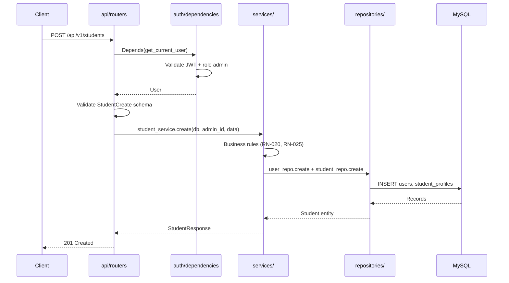

# 09 — Estrutura do Projeto

## Introdução

Este documento define a organização de pastas e arquivos do backend Smart Training, seguindo Clean Architecture com FastAPI, SQLAlchemy e separação clara de responsabilidades.

## Índice

- [Árvore de diretórios](#árvore-de-diretórios)
- [Responsabilidade das pastas](#responsabilidade-das-pastas)
- [Fluxo de uma request](#fluxo-de-uma-request)
- [Camadas da aplicação](#camadas-da-aplicação)
- [Configuração](#configuração)
- [Ponto de entrada main.py](#ponto-de-entrada-mainpy)
- [Exemplos por camada](#exemplos-por-camada)
- [Documentos relacionados](#documentos-relacionados)

---

## Árvore de diretórios

```
smart_training/
├── app/
│   ├── __init__.py
│   ├── main.py                      # Entry point FastAPI
│   │
│   ├── api/
│   │   ├── __init__.py
│   │   └── v1/
│   │       ├── __init__.py
│   │       ├── router.py            # Agregador de routers v1
│   │       └── routers/
│   │           ├── __init__.py
│   │           ├── auth.py
│   │           ├── students.py
│   │           ├── exercises.py
│   │           ├── trainings.py
│   │           ├── reports.py
│   │           ├── me.py            # Endpoints do aluno
│   │           ├── uploads.py
│   │           └── health.py
│   │
│   ├── auth/
│   │   ├── __init__.py
│   │   ├── dependencies.py        # get_current_user, require_role
│   │   ├── jwt_handler.py           # create/decode tokens
│   │   └── password.py              # hash/verify bcrypt
│   │
│   ├── core/
│   │   ├── __init__.py
│   │   ├── config.py                # Settings (Pydantic)
│   │   ├── exceptions.py            # Custom exceptions + handlers
│   │   └── pagination.py            # PaginatedResponse helper
│   │
│   ├── database/
│   │   ├── __init__.py
│   │   ├── session.py               # Engine, SessionLocal, get_db
│   │   └── base.py                  # DeclarativeBase
│   │
│   ├── models/
│   │   ├── __init__.py
│   │   ├── user.py
│   │   ├── admin_profile.py
│   │   ├── student_profile.py
│   │   ├── exercise.py
│   │   ├── exercise_image.py
│   │   ├── training.py
│   │   ├── training_day.py
│   │   ├── training_exercise.py
│   │   ├── attendance_record.py
│   │   ├── progress_photo.py
│   │   ├── progress_metric.py
│   │   └── refresh_token.py
│   │
│   ├── schemas/
│   │   ├── __init__.py
│   │   ├── auth.py
│   │   ├── student.py
│   │   ├── exercise.py
│   │   ├── training.py
│   │   ├── attendance.py
│   │   ├── progress.py
│   │   ├── report.py
│   │   ├── common.py                # ErrorResponse, Pagination
│   │   └── upload.py
│   │
│   ├── services/
│   │   ├── __init__.py
│   │   ├── auth_service.py
│   │   ├── student_service.py
│   │   ├── exercise_service.py
│   │   ├── training_service.py
│   │   ├── attendance_service.py
│   │   ├── progress_service.py
│   │   ├── report_service.py
│   │   └── upload_service.py
│   │
│   ├── repositories/
│   │   ├── __init__.py
│   │   ├── base_repository.py
│   │   ├── user_repository.py
│   │   ├── student_repository.py
│   │   ├── exercise_repository.py
│   │   ├── training_repository.py
│   │   ├── attendance_repository.py
│   │   ├── progress_repository.py
│   │   └── refresh_token_repository.py
│   │
│   ├── middleware/
│   │   ├── __init__.py
│   │   ├── request_id.py            # X-Request-ID
│   │   └── logging.py               # Request/response logging
│   │
│   ├── utils/
│   │   ├── __init__.py
│   │   ├── uuid.py                  # generate_uuid()
│   │   ├── dates.py                 # day_of_week helpers
│   │   └── file_validator.py        # MIME/magic bytes check
│   │
│   └── uploads/                     # Runtime dir (volume Docker)
│       ├── students/
│       └── exercises/
│
├── alembic/
│   ├── env.py
│   ├── script.py.mako
│   └── versions/
│
├── tests/
│   ├── conftest.py
│   ├── unit/
│   │   ├── test_auth_service.py
│   │   ├── test_training_service.py
│   │   └── ...
│   └── integration/
│       ├── test_auth_api.py
│       ├── test_students_api.py
│       └── ...
│
├── alembic.ini
├── requirements.txt
├── requirements-dev.txt
├── Dockerfile
├── docker-compose.yml
├── .env.example
└── pytest.ini
```

---

## Responsabilidade das pastas

| Pasta | Responsabilidade | Depende de |
|-------|------------------|------------|
| `api/` | Routers HTTP: recebe request, valida schema, chama service, retorna response | schemas, services, auth |
| `auth/` | Autenticação e autorização: JWT, dependencies, password hashing | core, models, repositories |
| `core/` | Configuração global, exceções, utilitários transversais | — |
| `database/` | Conexão SQLAlchemy, session factory, base declarativa | core |
| `models/` | Entidades ORM (SQLAlchemy models) mapeando tabelas MySQL | database |
| `schemas/` | DTOs Pydantic: request/response validation | — |
| `services/` | Lógica de negócio, orquestração, validações RN-* | repositories, schemas |
| `repositories/` | Acesso a dados (queries SQLAlchemy), CRUD | models, database |
| `middleware/` | Middlewares FastAPI (logging, request ID) | — |
| `utils/` | Funções utilitárias puras (sem dependência de framework) | — |
| `uploads/` | Armazenamento de arquivos (runtime, não versionado) | — |

### Regra de dependência

```
api → services → repositories → models → database
         ↓
      schemas (usado em todas as camadas externas)
```

**Proibido:**
- Router acessar repository diretamente (pular service)
- Repository conter lógica de negócio
- Model importar schema ou router

---

## Fluxo de uma request



---

## Camadas da aplicação

### Router (api/)

Responsabilidade: tradução HTTP ↔ aplicação.

```python
# app/api/v1/routers/students.py
@router.post("", response_model=StudentResponse, status_code=201)
async def create_student(
    data: StudentCreate,
    user: User = Depends(require_role("admin")),
    db: Session = Depends(get_db),
):
    return student_service.create(db, admin_id=user.id, data=data)
```

### Service (services/)

Responsabilidade: regras de negócio, transações, orquestração.

```python
# app/services/student_service.py
def create(db: Session, admin_id: str, data: StudentCreate) -> StudentResponse:
    if user_repo.exists_by_email(db, data.email):
        raise BusinessError("DUPLICATE_EMAIL", "Email já cadastrado.")
    hashed = hash_password(data.password)
    user = user_repo.create(db, email=data.email, password_hash=hashed, role="student")
    profile = student_repo.create(db, user_id=user.id, admin_id=admin_id, ...)
    db.commit()
    return StudentResponse.from_entity(user, profile)
```

### Repository (repositories/)

Responsabilidade: queries e persistência.

```python
# app/repositories/student_repository.py
def list_by_admin(db: Session, admin_id: str, page: int, limit: int) -> tuple[list, int]:
    query = (
        db.query(StudentProfile)
        .filter(StudentProfile.admin_id == admin_id, StudentProfile.deleted_at.is_(None))
    )
    total = query.count()
    items = query.offset((page - 1) * limit).limit(limit).all()
    return items, total
```

### Model (models/)

Responsabilidade: mapeamento ORM.

```python
# app/models/student_profile.py
class StudentProfile(Base):
    __tablename__ = "student_profiles"
    user_id: Mapped[str] = mapped_column(CHAR(36), ForeignKey("users.id"), primary_key=True)
    admin_id: Mapped[str] = mapped_column(CHAR(36), ForeignKey("users.id"), nullable=False)
    full_name: Mapped[str] = mapped_column(String(150), nullable=False)
    # ...
```

### Schema (schemas/)

Responsabilidade: validação e serialização.

```python
# app/schemas/student.py
class StudentCreate(BaseModel):
    email: EmailStr
    password: str = Field(min_length=8)
    full_name: str = Field(min_length=2, max_length=150)
    phone: str | None = None
    birth_date: date | None = None
    height_cm: float | None = Field(None, gt=0, le=300)
    weight_kg: float | None = Field(None, gt=0, le=500)
    goal: str | None = None
    notes: str | None = None

    @field_validator("password")
    @classmethod
    def validate_password(cls, v: str) -> str:
        if not re.search(r"[A-Za-z]", v) or not re.search(r"\d", v):
            raise ValueError("Senha deve conter letra e número.")
        return v
```

---

## Configuração

```python
# app/core/config.py
from pydantic_settings import BaseSettings, SettingsConfigDict

class Settings(BaseSettings):
    model_config = SettingsConfigDict(env_file=".env", extra="ignore")

    app_name: str = "Smart Training"
    app_env: str = "development"
    app_debug: bool = False
    database_url: str
    jwt_secret_key: str
    jwt_algorithm: str = "HS256"
    access_token_expire_minutes: int = 15
    refresh_token_expire_days: int = 7
    upload_max_size_mb: int = 5
    upload_dir: str = "/app/uploads"
    cors_origins: str = "*"

    @property
    def cors_origins_list(self) -> list[str]:
        return [o.strip() for o in self.cors_origins.split(",")]

settings = Settings()
```

---

## Ponto de entrada main.py

```python
# app/main.py
from contextlib import asynccontextmanager
from fastapi import FastAPI
from fastapi.middleware.cors import CORSMiddleware

from app.api.v1.router import api_v1_router
from app.core.config import settings
from app.core.exceptions import register_exception_handlers
from app.middleware.logging import LoggingMiddleware
from app.middleware.request_id import RequestIdMiddleware

@asynccontextmanager
async def lifespan(app: FastAPI):
    # Startup: verificar conexão DB, criar dirs upload
    yield
    # Shutdown: cleanup

app = FastAPI(
    title=settings.app_name,
    version="1.0.0",
    docs_url="/docs",
    redoc_url="/redoc",
    lifespan=lifespan,
)

app.add_middleware(CORSMiddleware, allow_origins=settings.cors_origins_list, ...)
app.add_middleware(RequestIdMiddleware)
app.add_middleware(LoggingMiddleware)

register_exception_handlers(app)

app.include_router(api_v1_router, prefix="/api/v1")
```

```python
# app/api/v1/router.py
from fastapi import APIRouter
from app.api.v1.routers import auth, students, exercises, trainings, reports, me, uploads, health

api_v1_router = APIRouter()
api_v1_router.include_router(health.router, tags=["Health"])
api_v1_router.include_router(auth.router, prefix="/auth", tags=["Auth"])
api_v1_router.include_router(students.router, prefix="/students", tags=["Students"])
api_v1_router.include_router(exercises.router, prefix="/exercises", tags=["Exercises"])
api_v1_router.include_router(trainings.router, prefix="/trainings", tags=["Trainings"])
api_v1_router.include_router(reports.router, prefix="/reports", tags=["Reports"])
api_v1_router.include_router(me.router, prefix="/me", tags=["Student Area"])
api_v1_router.include_router(uploads.router, prefix="/uploads", tags=["Uploads"])
```

---

## Exemplos por camada

### Exception handler centralizado

```python
# app/core/exceptions.py
class BusinessError(Exception):
    def __init__(self, code: str, message: str, status_code: int = 400):
        self.code = code
        self.message = message
        self.status_code = status_code

def register_exception_handlers(app: FastAPI):
    @app.exception_handler(BusinessError)
    async def business_error_handler(request, exc: BusinessError):
        return JSONResponse(
            status_code=exc.status_code,
            content={"error": {"code": exc.code, "message": exc.message, "details": {}}},
        )
```

### Database session

```python
# app/database/session.py
from sqlalchemy import create_engine
from sqlalchemy.orm import sessionmaker, Session
from app.core.config import settings

engine = create_engine(settings.database_url, pool_pre_ping=True, pool_size=10)
SessionLocal = sessionmaker(autocommit=False, autoflush=False, bind=engine)

def get_db():
    db = SessionLocal()
    try:
        yield db
    finally:
        db.close()
```

---

## Documentos relacionados

- [03-modelagem-banco.md](03-modelagem-banco.md) — Models SQLAlchemy
- [05-api-rest.md](05-api-rest.md) — Routers a implementar
- [08-docker.md](08-docker.md) — Containerização
- [12-convencoes.md](12-convencoes.md) — Padrões de código
