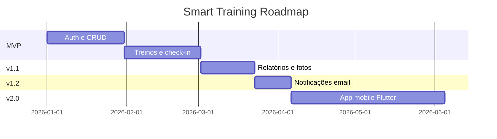

# 10 — Roadmap

## Introdução

Este documento apresenta o plano de evolução do Smart Training em fases incrementais, com critérios de aceite, backlog priorizado (MoSCoW) e débitos técnicos conhecidos.

## Índice

- [Visão geral das fases](#visão-geral-das-fases)
- [Fase 1 — MVP](#fase-1--mvp)
- [Fase 2 — v1.1 Relatórios e mídia](#fase-2--v11-relatórios-e-mídia)
- [Fase 3 — v1.2 Notificações](#fase-3--v12-notificações)
- [Fase 4 — v2.0 Mobile](#fase-4--v20-mobile)
- [Backlog MoSCoW](#backlog-moscow)
- [Débitos técnicos](#débitos-técnicos)
- [Documentos relacionados](#documentos-relacionados)

---

## Visão geral das fases



| Fase | Versão | Duração estimada | Entrega principal |
|------|--------|:----------------:|-------------------|
| 1 | MVP | 8–10 semanas | API funcional com auth, CRUD, treinos, check-in |
| 2 | v1.1 | 3 semanas | Relatórios completos, upload fotos, métricas |
| 3 | v1.2 | 2 semanas | Notificações por email |
| 4 | v2.0 | 8+ semanas | App mobile + melhorias UX |

---

## Fase 1 — MVP

### Objetivo

Entregar API REST funcional que permita ao Personal Trainer gerenciar alunos e treinos, e ao aluno visualizar treino e registrar presença.

### Escopo

| Módulo | Features |
|--------|----------|
| Infra | Docker Compose, Alembic, health check |
| Auth | Login, refresh, logout, JWT, seed admin |
| Alunos | CRUD completo, soft delete, ativar/desativar |
| Exercícios | CRUD catálogo |
| Treinos | CRUD, dias da semana, exercícios por dia, ativação |
| Aluno | Visualizar treino, check-in diário |
| Testes | Unitários services + integração auth/students/trainings |

### Critérios de aceite

- [ ] Admin faz login e recebe JWT válido
- [ ] Admin cadastra aluno com email/senha
- [ ] Admin cria exercício no catálogo
- [ ] Admin monta treino com 3+ dias e exercícios
- [ ] Admin ativa treino; treino anterior é completado automaticamente
- [ ] Aluno faz login e vê treino do dia
- [ ] Aluno registra check-in (1x/dia)
- [ ] Aluno não acessa dados de outro aluno (403)
- [ ] Admin não acessa alunos de outro admin (403)
- [ ] Swagger documenta todos os endpoints MVP
- [ ] `docker compose up` sobe sistema completo
- [ ] Cobertura de testes ≥ 70% em services

### Entregáveis

```
✓ API FastAPI rodando em Docker
✓ 12 tabelas MySQL com migrations
✓ ~30 endpoints REST documentados
✓ README com instruções de setup
```

---

## Fase 2 — v1.1 Relatórios e mídia

### Objetivo

Completar funcionalidades de acompanhamento: fotos de evolução, imagens de exercícios, relatórios e métricas.

### Escopo

| Módulo | Features |
|--------|----------|
| Upload | Fotos aluno, imagens exercício, validação MIME |
| Evolução | Timeline fotos, métricas corporais |
| Relatórios | Overview, por aluno, frequência agregada |
| Dashboard | KPIs documentados em 06-dashboard-admin.md |

### Critérios de aceite

- [ ] Aluno envia foto de evolução (JPEG/PNG/WebP, max 5MB)
- [ ] Admin visualiza galeria de fotos por aluno
- [ ] Admin anexa até 5 imagens por exercício
- [ ] Aluno visualiza imagens dos exercícios do treino
- [ ] Dashboard retorna KPIs corretos (GET /reports/overview)
- [ ] Relatório individual do aluno com delta de peso
- [ ] Uploads persistidos em volume Docker
- [ ] Arquivos acessíveis apenas com auth + permissão

---

## Fase 3 — v1.2 Notificações

### Objetivo

Engajamento proativo via notificações por email.

### Escopo

| Feature | Descrição |
|---------|-----------|
| Email treino expirando | Admin recebe alerta 7 dias antes do `end_date` |
| Email check-in | Aluno recebe lembrete se não fez check-in em 3 dias |
| Email boas-vindas | Aluno recebe credenciais ao ser cadastrado |
| Job scheduler | APScheduler ou Celery Beat |

### Critérios de aceite

- [ ] Admin recebe email quando treino expira em 7 dias
- [ ] Aluno recebe email de boas-vindas com credenciais
- [ ] Jobs executam diariamente via scheduler
- [ ] Templates HTML responsivos
- [ ] Configuração SMTP via variáveis de ambiente

---

## Fase 4 — v2.0 Mobile

### Objetivo

App mobile (Flutter) consumindo a API existente.

### Escopo

| Feature | Descrição |
|---------|-----------|
| App Flutter | Login, treino do dia, check-in, upload foto |
| Push notifications | Firebase Cloud Messaging |
| Offline cache | Treino do dia cached localmente |
| Biometria | Login com fingerprint/face |

### Critérios de aceite

- [ ] App publicado (TestFlight / Play Console internal)
- [ ] Todas funcionalidades do aluno disponíveis
- [ ] Upload de foto via câmera nativa
- [ ] Push notification para lembrete de treino

---

## Backlog MoSCoW

### Must Have (MVP)

| # | Item | Fase |
|---|------|:----:|
| M1 | Autenticação JWT | 1 |
| M2 | CRUD alunos | 1 |
| M3 | CRUD exercícios | 1 |
| M4 | CRUD treinos com dias/exercícios | 1 |
| M5 | Visualização treino (aluno) | 1 |
| M6 | Check-in diário | 1 |
| M7 | Docker Compose funcional | 1 |
| M8 | Isolamento multi-tenant por admin | 1 |

### Should Have (v1.1)

| # | Item | Fase |
|---|------|:----:|
| S1 | Upload fotos evolução | 2 |
| S2 | Imagens ilustrativas exercícios | 2 |
| S3 | Relatórios e KPIs | 2 |
| S4 | Métricas corporais | 2 |
| S5 | Histórico de treinos | 2 |

### Could Have (v1.2+)

| # | Item | Fase |
|---|------|:----:|
| C1 | Notificações email | 3 |
| C2 | Export CSV relatórios | 3 |
| C3 | Reset de senha por email | 3 |
| C4 | Múltiplos admins (SaaS) | 3 |
| C5 | App mobile Flutter | 4 |
| C6 | Push notifications | 4 |

### Won't Have (por enquanto)

| # | Item | Motivo |
|---|------|--------|
| W1 | Pagamentos/assinaturas | Fora do escopo |
| W2 | Chat admin-aluno | Complexidade; usar WhatsApp |
| W3 | Vídeos de exercícios | Storage cost; futuro |
| W4 | IA para montar treinos | Requer ML pipeline |
| W5 | Cadastro público | Regra de negócio: admin cria alunos |

---

## Débitos técnicos

| ID | Débito | Prioridade | Fase resolução |
|----|--------|:----------:|:--------------:|
| DT-01 | Rate limiting nos endpoints de auth | Alta | 1 |
| DT-02 | Testes E2E com banco real em CI | Média | 1 |
| DT-03 | Rotação de refresh tokens | Média | 2 |
| DT-04 | CDN para uploads em produção | Baixa | 2 |
| DT-05 | Migrations idempotentes | Baixa | 1 |
| DT-06 | Observabilidade (OpenTelemetry) | Baixa | 3 |
| DT-07 | Cache Redis para relatórios | Baixa | 3 |

---

## Documentos relacionados

- [01-visao-geral.md](01-visao-geral.md) — Escopo MVP vs futuro
- [05-api-rest.md](05-api-rest.md) — Endpoints por fase
- [08-docker.md](08-docker.md) — Infraestrutura
- [12-convencoes.md](12-convencoes.md) — Padrões de desenvolvimento
