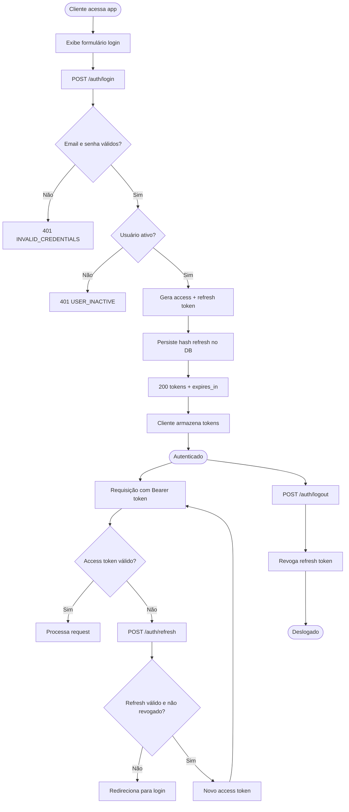
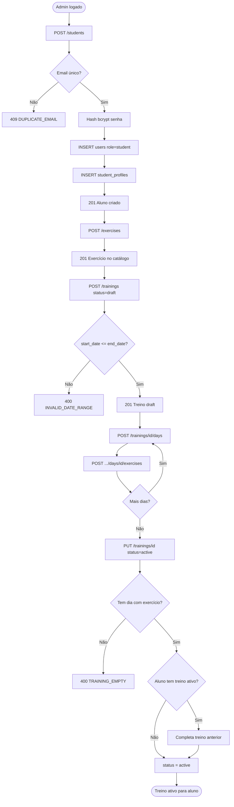
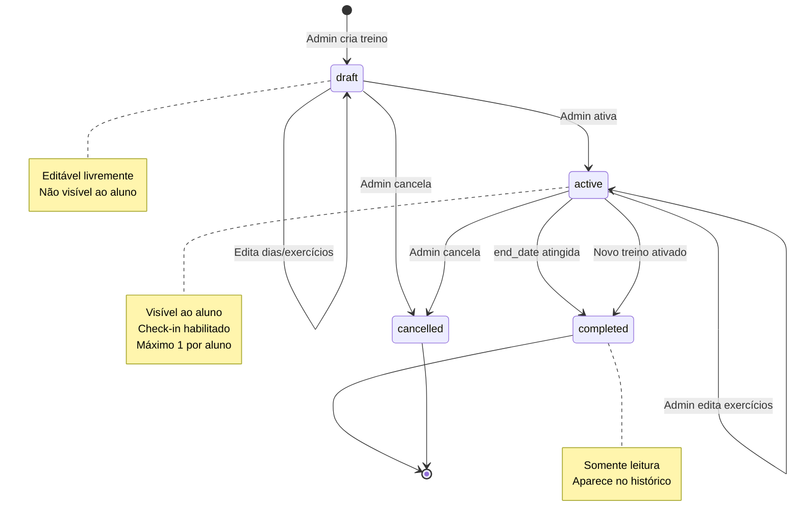
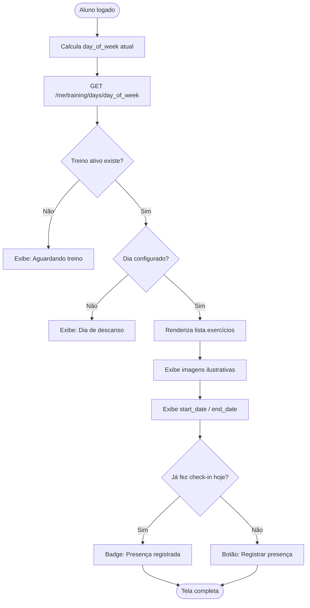
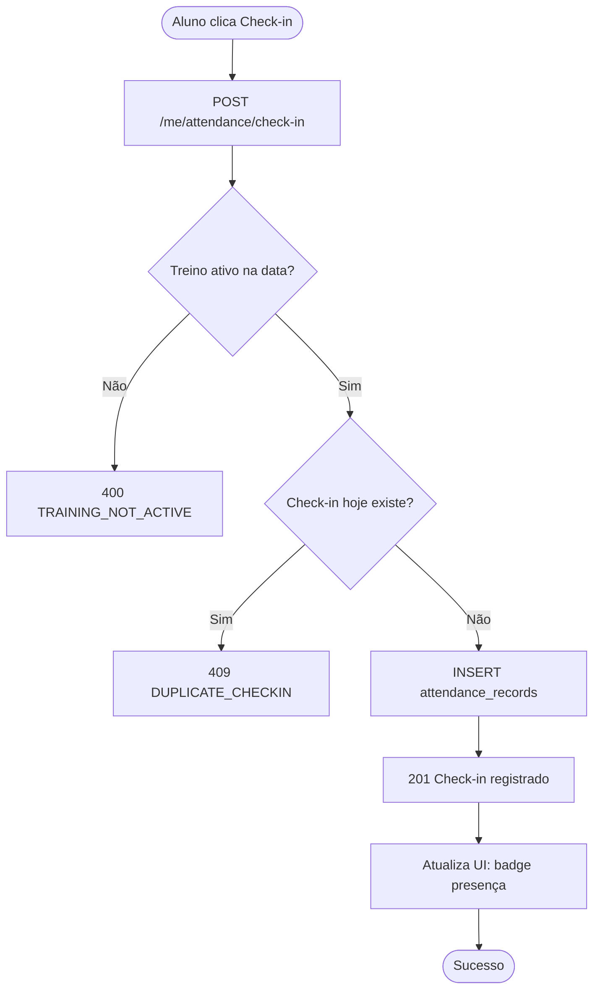
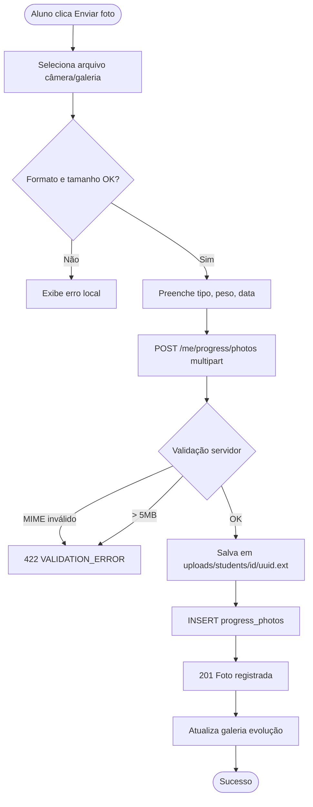
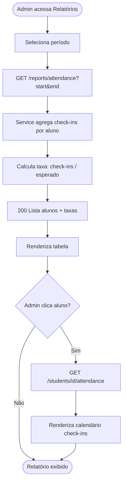
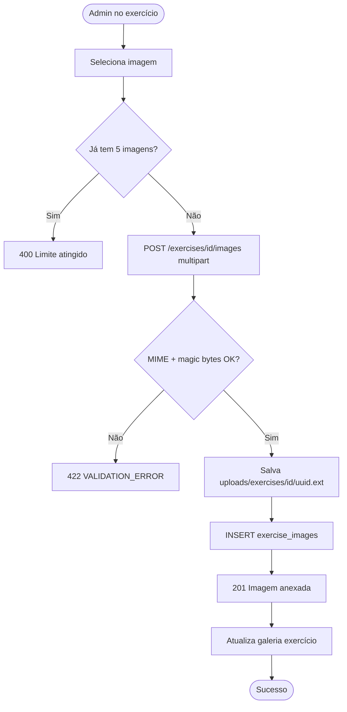

# 11 — Fluxos

## Introdução

Este documento apresenta os fluxogramas dos processos principais do Smart Training em diagramas Mermaid, servindo como referência visual para implementação e testes.

## Índice

- [Login e refresh token](#login-e-refresh-token)
- [Admin cadastra aluno e treino](#admin-cadastra-aluno-e-treino)
- [Ciclo de vida do treino](#ciclo-de-vida-do-treino)
- [Aluno consulta treino do dia](#aluno-consulta-treino-do-dia)
- [Aluno registra check-in](#aluno-registra-check-in)
- [Aluno envia foto de evolução](#aluno-envia-foto-de-evolução)
- [Admin visualiza relatório de frequência](#admin-visualiza-relatório-de-frequência)
- [Upload de imagem de exercício](#upload-de-imagem-de-exercício)
- [Documentos relacionados](#documentos-relacionados)

---

## Login e refresh token



---

## Admin cadastra aluno e treino



---

## Ciclo de vida do treino



---

## Aluno consulta treino do dia



---

## Aluno registra check-in



---

## Aluno envia foto de evolução



---

## Admin visualiza relatório de frequência



### Cálculo da taxa de frequência

```
taxa = (check_ins_no_periodo / sessoes_esperadas) × 100

sessoes_esperadas = dias_de_treino_por_semana × semanas_no_periodo

Exemplo:
  Treino: seg, qua, sex (3 dias/semana)
  Período: 4 semanas
  Esperado: 12 sessões
  Check-ins: 9
  Taxa: 75%
```

---

## Upload de imagem de exercício



---

## Documentos relacionados

- [02-regras-de-negocio.md](02-regras-de-negocio.md) — Regras RN-* referenciadas nos fluxos
- [04-autenticacao.md](04-autenticacao.md) — Detalhes JWT
- [05-api-rest.md](05-api-rest.md) — Endpoints de cada fluxo
- [06-dashboard-admin.md](06-dashboard-admin.md) — Telas admin
- [07-area-aluno.md](07-area-aluno.md) — Telas aluno
